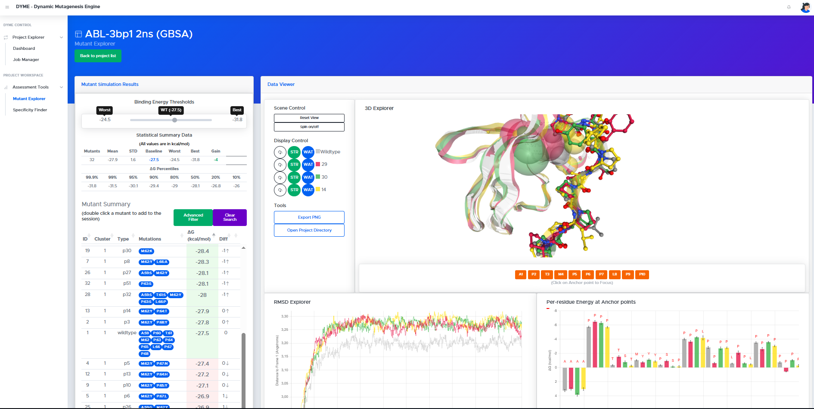

# DYME (Dynamic Mutagenesis Engine)

## Overview

DYME is a computational platform for automated large-scale molecular dynamics (MD) analysis and high-throughput mutational exploration. It orchestrates HTP mutagenesis, MD simulations and visual comparative analysis into a single workflow. This README covers installation, deployment and key technical details required to operate the platform.

 

The system is made of two distributed components:

**dyme_main**: A single server (Docker) hosting a central database, web UI and API  
**dyme_node**: A worker container (Singularity/Apptainer) executing asynchronous MD and scavenging tasks

---

## Architecture

- **Main Node (runs in Docker)**
  - Deployed in a single server
  - Exposes ports:
    - `8080` (API/UI)
    - `27017` (MongoDB access)

- **Worker Nodes (runs with Apptainer/Singularity)**
  - Deployed in as many servers as desired. Executes tasks in two modes:
    - `MD` → runs simulations (GPU-only)
    - `scavenger` → processes completed MD trajectories (CPU-only)

- **Shared Storage**
  - All nodes access a common filesystem 
  - Recommended: network-mounted directory (NFS/Beegfs/Lustre,etc)

DyME runs exclusively in Linux (x86_64) systems. We highly recommend debian-based (Ubuntu ≥ 22.04) or RHEL-based distros. Other flavors could work but are not currently supported by the installer.

---

## Minimum Hardware Recommendations

- **Main Node**
  - 8 to 32 CPU cores (scale for best performance)
  - 8 to 128 GB RAM

- **Worker Nodes**
  - At least 8 CPUs per scavenger node (up to 256 CPUs per server recommended)
  - At least 1 GPU card per MD node (currently CUDA-compatible cards only)
  
- **Storage**
  - 20GB for installing + building the system (at the main node server)
  - Enough space for hundreds of MD simulations (several GB to several TB)
  - User must have write-permissions in the shared partition
    
- **Network**
  - All nodes (main and worker) should reside in the same network (recommended)
  - Distributed networks will work as long as the worker nodes can ping the main node
      
---

## Build and Install Requirements

The DyME installer and containers depend on third-party components:

- Docker (for building and hosting the main node)
- BuildX (Docker build plugin)
- Apptainer / Singularity ≥ 3.10 (for worker node deployment)

- Salilab's MODELLER license (for model creation)  
  (Request a free academic license key here: https://salilab.org/modeller/registration.html)

The installer will check for pre-requisites and attempt to install missing dependencies (Docker, BuildX Apptainer, curl, and others). It will also verify your user has permissions to run docker containers. If the installer is unable to solve dependencies, install them manually and run the installer again.

---

## Installation

The DyME installer automatically builds the platform for you. To begin, login to the machine that will act as "Main Node" and navigate to a suitable directory. Make sure you have at least 20Gb of free space available for building and storing container images.

Step 1 - Clone the DYME repository, and execute the installer:

```bash
git clone https://github.com/pisabarro-group/DYME.git
cd DYME
chmod a+x install.sh
./install.sh
```

This action should yield:
- A Docker image called `dyme_main` (This is your main server container)
- A Singularity `.sif` image called `dyme_node.sif` (This contains the worker node container)

The installer will create the necesary folders in the directory provided as shared folder (dyme_root). It will be used as persistent storage (databases, MD trajectories, inputs, outputs, etc) and should be "accesible" from all nodes - as it binds to the internal directory `/dyme_root` in containers.

Step 2- Verify the Main Node is up

Upon completion, the DyME Main node should be running on Docker. You can access the UI by entering http://the_server_hostname:8080 in your browser.


---

## Test Data

To install test-data, answer "y" when prompted to do so by the installer. It will be downloaded from here (https://zenodo.org/records/18014320) and loaded into your fresh DyME system automatically. It contains two projects and approx. ~11GB of MD simulations, plus the corresponding database records.

  **DO NOT DOWNLOAD OR MANUALLY HANDLE THE TEST-DATA - THE INSTALLER WILL DO THIS FOR YOU**

A detailed example on interpreting the test-data can be found on the supplementary material of the DyME publication (link pending)

---

## Running The Main Node

The main node runs on any server with Docker (by default, this is where you ran the installer). The following commands control the container (start or stop). Keep in mind this node must remain active for remote workers to perform tasks, access the database, or using the DyME-TCA web to explore results.

### Main node start

Replace "/path/to/filesystem" with the folder (dyme_root) provided during installation. The shared folder must be bound to the internal /dyme_root folder of containers, else they won't be able to access persistent data.

```bash
   docker run \
        --name dyme_main \
        -d \
        -v "/path/to/filesystem:/dyme_root" \
        -p 8080:80 \
        -p 27017:27017 \
        dyme_main:latest
```

To stop the DyME Main node, execute the following cmd:
### Main node stop
```bash
   docker stop dyme_main
```

---

## Running Workers

Worker nodes reside in the .sif container called `dyme_node.sif` created during installation. The container can run either as MD node, or as savenger node. The container is fully **portable**. It can be copied to remote servers, HPC partitions or shared locations.

- You will need Apptainer (or Singularity) on servers to launch a worker node
- You can run both nodes (MD and scavenger) on the same server by booting 2 separate containers
- The container can run manually (from the console) or using a queue manager (i.e. SLURM)
- SLURM batch files must be crafted by the user for their respective HPC environment


### Tip:
DyME includes a wrapper script (**launch_node.sh**) to facilitate deployment. Keep in mind the script requires the .sif container to be located in the same directory. 

The .sif file can be copied to a shared location. If so, modify the variable **$SIF_IMAGE** inside the script so that it points to the full path to the file. This way the wrapper will work from any server within your environment.

The syntax to use the wrapper is:

```bash
./launch_node.sh <nodetype> <dbhostname> </path/to/shared/data>
```

### Parameters

- The `nodetype` can be:
  - `MD` → simulation node (requires GPU cards on the server)
  - `scavenger` → analysis node (CPU only)

- `dbhostname`:
  - hostname or IP of the main node

- `path`:
  - path to shared directory mounted across all nodes


To start a worker node manually (using Apptainer directly), modify the required variables and run the following commands:

```bash
 export BINDPATH=/path/to/shared/directory
 export SIF_IMAGE=dyme_node.sif
 export NODETYPE=MD
 export DBHOST=name_of_main_dyme_server

 apptainer --nv exec \
    --bind "$BINDPATH":"/dyme_root" \
    --bind /dev/shm:/dev/shm \
    "$SIF_IMAGE" \
    "$NODETYPE" "$DBHOST"
```

### Examples

Launch an MD node with Main node hosted at 192.168.1.10, and shared folder at /group/dyme_data

```bash
 ./launch_node.sh MD 192.168.1.10 /group/dyme_data
```

Launch a scavenger node, with Main node hosted at localhost, and shared folder at /data/dyme
```bash
 ./launch_node.sh scavenger localhost /data/dyme
```

You can redirect the worker output to your favorite log file. It will contain extremely detailed information on what the containers are doing at every satage of the workflow.

---

## Accessing the DyME Database Manually

DyME uses MongoDB as database engine. All components and active nodes communicate through it. The database can be accessed using GUI tools like "MongoDB Compass" or even low-level drivers like "pymongo", from your own python scripts.

- The database has no username or password set by default.
- It is exposed through port `27017` at the Main Node server.
- The DymeDB() class can be re-used to manage DB connections.
- To connect to the database use a connection URI:

```bash
 mongodb://IP_or_hostname_of_main_node:27017/?directConnection=true
```

The database "dyme" hosts the following collections and views:

```text
 -COLLECTIONS:
  default_settings       #System paths defined during install
  mutants                #One document per mutant entity 
  processed_data         #Full collection of scavenged data per mutant 
  projects               #Project data, residue maps, md settings, objects and definitions

 -VIEWS:
  mutants_deltag         #Aggregation pipeline combining energetics and mutant data
  mutants_ready          #Auxiliaty view for status updater
  mutants_status         #Aggregation for grouping mutants by project and status
```

###Query Examples
```js
use dyme
db.mutants.find({status: "pending", id_project: 3})   //Queries pending mutants on Project 3.
db.processed_data.find({id_project: 3, mutantID: 55}) //Queries all data for mutantID 55 of project 3
```

For more information on collections and document structure can be found at the supplementary material of the DyME publication (pending)

---

## Accessing MD trajectories, Inputs and Outputs

Worker nodes deposit MD simulations and assets in the shared folder (dyme_root) under the subfolder **/projects** and it follows the following structure:


**Directory Structure**
```text
/dyme_root
├── projects/                   # Root folder for all projects
│   ├── 1/
│   ├── 2/
│   └── 3/                      # Example project folder
│       ├── inputs/             # Initial input files (Original PDB and tleap scripts)
│       ├── outputs/            # Reserved for future use
│       └── mutants/            # Contains a dedicated folder per MutantID
│           ├── 1/
│           ├── 2/
│           └── 3/              # Example mutant folder
│               ├── inputs/     # Generated structures and input files for MD (from preparation stage)
│               └── outputs/    # MD simulations and scavenging outputs 
```
**Input files (per mutant):**
```text
│               ├── inputs/
│                    ├──ligand.prmtop                 #Ligand parameters/topology
│                    ├──receptor.prmtop               #Receptor parameters/topology
│                    ├──original_mutated.pdb          #Mutated PDB file 
│                    ├──receptor_ligand.prmtop        #Complex parameters/topology 
│                    ├──receptor_ligand.inpcrd        #Complex coordinates 
│                    ├──receptor_ligand_wat.prmtop    #Solvated complex parameters/topology
│                    ├──receptor_ligand_wat.inpcrd    #Solvated complex coordinates
│                    ├──receptor_ligand_wat.pdb       #Solvated complex PDB
│                    ├──tleap.in                      #Generated Tleap generator input file
│                    └── mmgbsa/    
│                          ├──pairwise.in             #MMPBSA.py input configs
│                          └──perresidue.in           #MMPBSA.py input configs
```

**Output files (per mutant):**
```text
│               ├── outputs/
│                    ├──eq.chk                        #Simulation checkpoint
│                    ├──output_md.h5                  #MD trajectory file (in HDF5 format)
│                    ├──output_bestpdb.pdb            #Best pose (by total energy)
│                    ├──output_bestpdb_wat.pdb        #Best pose (same, but hydrated)
│                    ├──output_process.txt            #MD execution log
│                    ├──output_pairwise.dat           #MMPBSA.py output
│                    ├──output_perresidue.dat         #MMPBSA.py output
│                    ├──output_pairwise_decomp.dat    #MMPBSA.py decomposition
│                    └──output_perresidue_decomp.dat  #MMPBSA.py decomposition
```

Scavenging outputs for intermolecular contacts, water sites and RMSD data are stored directly in the Database (collection "processed_data").

---

## Execution Behavior

### The MD Node
- Runs MD simulation workloads
- Continuously polls and updates the database
- Uses GPU acceleration (`--nv`)
- Deploys ONE simulation per idle GPU card (unless told otherwise)
- Safe for parallel multi-node execution (atomic DB claiming)

### Scavenger Node (default behavior)
- Continuously polls database
- Selects mutants with status = "ready_to_scavenge"
- Processes mutants in batches. Batch_size = available_cpus // 8
- Works across all projects automatically
- Safe for parallel multi-node execution (atomic DB claiming)

---

## Citation

If you use DYME in your research, please cite:

[Paper / preprint / DOI]

---